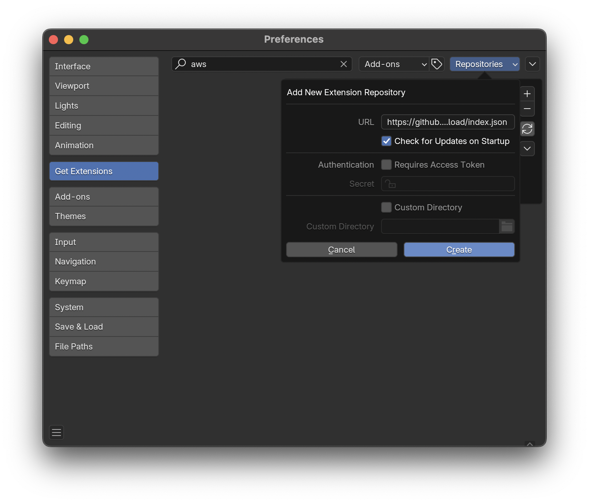
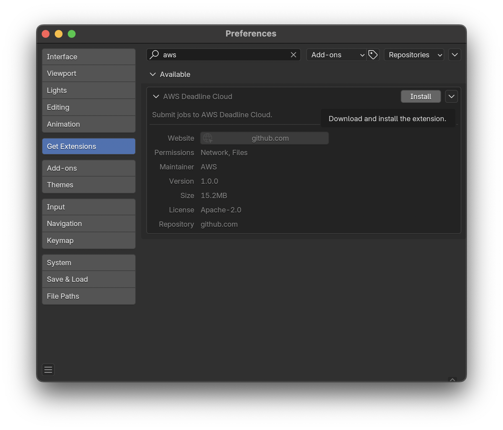

# Installing the Deadline Cloud for Blender submitter from Blender
> This is an experimental feature and is subject to change.

You can install and update the Blender submitter from within Blender using Blender's extension feature.

To install the Blender submitter using Blender extensions, you will need:

- Blender 4.2 or later
- A workstation with consistent internet access

**To add the Blender submitter as an extension**

1. Open Blender. 
1. On the **Edit** menu, choose **Preferences...**.
1. Choose **Get Extensions** on the left side bar.
1. Choose **Repositories**, **+**, **Add Remote Repository**.

1. For, **URL** enter `https://github.com/aws-deadline/deadline-cloud-for-blender/releases/latest/download/index.json`.
1. Select **Check for Updates on Startup** and choose **Create**.
1. On the **AWS Deadline Cloud** entry under **Available**, choose **Install**.

The add-on is now installed! You can use the new **Submit to AWS Deadline Cloud** option in the **Render** menu.

When an update is available, an **Update** button will appear next to the **AWS Deadline Cloud** entry in the **Get Extensions** section.