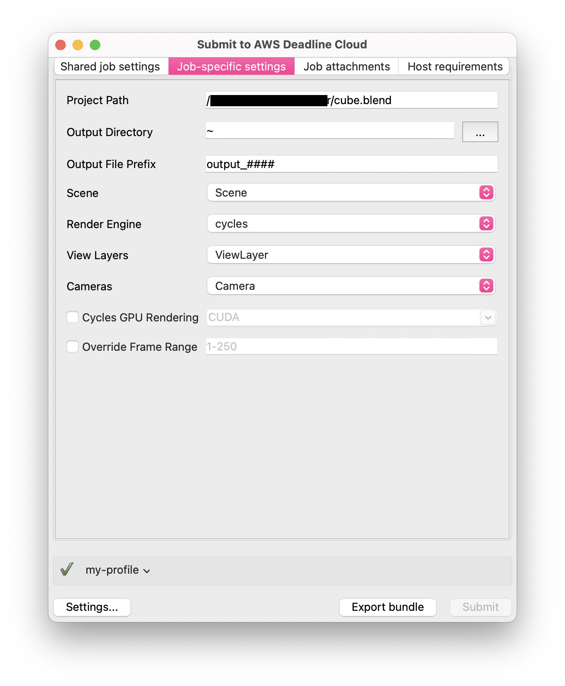

# Using the Deadline Cloud for Blender submitter

To use the Deadline Cloud for Blender submitter, you will need:

- A profile to submit to Deadline Cloud with
- A Deadline Cloud farm and queue to submit to

## Submit a job

**To submit a job from Blender to Deadline Cloud**

1. Save your Blender file.
1. In Blender's **Render** menu, choose **Submit to AWS Deadline Cloud**.
    - You may see a pop-up to install GUI dependencies. Choose **OK** and wait for the dialog to disappear, then choose **Submit to AWS Deadline Cloud** again.
1. Use the tabs in the dialog to customize your job.
1. (Optional) To export a job's associated files to your job history directory without submitting it, choose **Export bundle**.
    - A _job bundle_ is a group of files that defines a job. For more information, see [Open Job Description templates for Deadline Cloud](https://docs.aws.amazon.com/deadline-cloud/latest/developerguide/build-job-bundle.html).
1. Choose **Submit** and follow the prompts to send your job to Deadline Cloud.

## Blender-specific Settings
The **Job-specific settings** tab has options specific to jobs created in Blender.

  - *Project Path* - The location where the current project is saved. Can't be changed.
  - *Output Directory* - The location to save file outputs from the render job.
  - *Output File Prefix* - The pattern to use when naming file outputs, follows Blender's convention for file names. Output files are formatted like `[LayerName]_[CameraName]_[OutputPrefix].[EXT]`.
  - *Scene* - The scene from the current project to render.
  - *Render Engine* - The render engine (Cycles, EEVEE, or Workbench) to use.
  - *View Layers* - The layer to render, or "All Renderable Layers" to render each applicable layer in the scene separately.
  - *Cameras* - The camera to render, or "All Renderable Cameras" to render each camera in the scene separately.
  - *Cycles GPU Rendering* - Select this to enable GPU rendering. Choose a device type supported by Blender or specify your own. If this device type is not supported on your rendering machine, the adaptor will attempt to use a compatible device type before falling back to CPU rendering.
  - *Override Frame Range* - Select this to render a different frame or frame range than is set in the scene file. Frame ranges follow the [Open Job Description](https://github.com/OpenJobDescription/openjd-specifications/wiki/2023-09-Template-Schemas#34111-intrangeexpr) pattern.

For information about the other submitter tabs, see the [AWS Deadline Cloud guide for using a submitter](https://docs.aws.amazon.com/deadline-cloud/latest/userguide/jobs-using-submitter.html).

## Monitoring your jobs

You can monitor job progress using the Deadline Cloud monitor. For more information, see the [AWS Deadline Cloud guide for using the monitor](https://docs.aws.amazon.com/deadline-cloud/latest/userguide/working-with-deadline-monitor.html).

## Getting help

- Contact AWS Support
- (Requires a GitHub account) [Open an issue in `deadline-cloud-for-blender` on GitHub](https://github.com/aws-deadline/deadline-cloud-for-blender/issues)